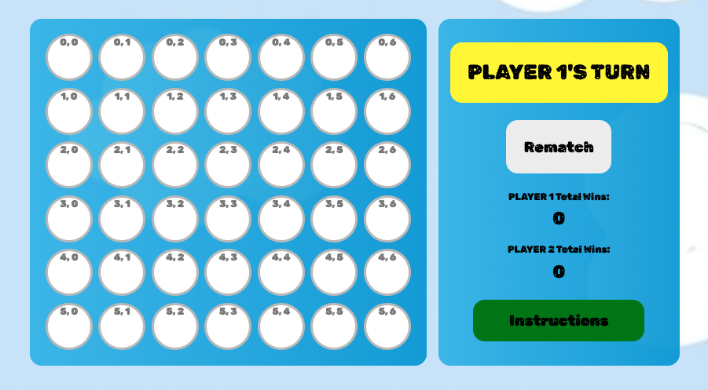

# Intro to Connect 4

Connect 4 is a 2 player game, where each take turns to drop colored pieces into a grid (7 columns x 6 rows). Each colored piece will fall straight down to the lowest available space within the column. A winner emerges when he/she manages to form a horizontal, vertical or diagonal line of his/her own colored pieces.

## Technologies Used

Built using HTML, CSS and vanilla Javascript.

## General Approach Taken
1. generateBoard, displayBoard: A board with 7 columns and 6 rows is generated using a nested for loop (refer to image example below where we assigned the first number to represent the row, and the second number to represent the column). The DOM is manipulated with each circle being created in the nested for loop. Event listener is also added to each circle so that any clicks by user can be processed later on.
2. 

2. handleClick: Once user clicks on anywhere in the grid, the coordinates of the click are saved in the variables yPos and xPos. These are fed as arguments into the function getRestingPlace, which essentially finds out what is the lowest (a.k.a resting) available space within the column. Remember a user can click anywhere in the grid and we need to know which is the lowest circle we can drop the piece into!

3. getRestingPlace: We find this out by checking if each circle in that column is filled (!== ""). If filled, we will push that circle into an empty array. Finally, we will use array.length to find out how many of such filled circles had been pushed into the array and from there we can derive which coordinates we should place our colored piece at.

4. dropPiece: The coordinates of the final resting place will be fed as arguments into the dropPiece function. We will use this function to animate the dropping of the colored piece from the top of the grid downwards to the resting place. This is possible by utilising getBoundingClientRect, which lets us know the absolute position of the resting place, i.e. the y coordinate will let us know how far to drop the colored piece to, from the top of the page.

5. checkWin: To check if the latest colored piece placed by a player forms a winning row of 4, a nested for loop array is used to check every circle in the grid for whether the circle belongs to the player's color, and if yes, do they form a consecutive vertical, horizontal or diagonal line? If yes, return value of player will feed back into handleClick function which saves the result into a global variable. displayBoard will then access it for use in manipulation of the DOM to reflect the results of the game.
</ol>

## How To Play
### Classic Mode:
Player 1 starts by clicking anywhere in the grid. Upon a click, the colored piece assigned to Player 1 will fall straight down to the lowest available space within the column he/she has clicked on. Winner will be announced via circling of the 4 colored pieces.

### Special
Player 1 starts by pressing anywhere on the keyboard. As long as the spaceship is above a column, the colored piece assigned to Player 1 will fall straight down to the lowest available space within the column. Column here is determined at the moment when the user presses the keyboard and where the spaceship is located at then. E.g. if spaceship was above column 2 when the keyboard was pressed, the colored piece will fall through column 2.

## Future Goals
1. User can select a bigger grid.
2. More than 2 players can play Connect 4.
